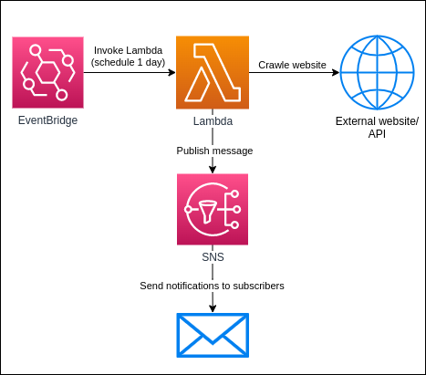

# Offer Notification Application

A simple application built on AWS with Serverless, which crawls a website for offers and sends an email notification when the offer is found.

## Architecture



### Used AWS Services

- EventBridge - For scheduling Lambda function invocation
- Lambda - For crawling the website and publishing to SNS
- SNS - For sending email notifications

## Used technologies

- NodeJS
- Serverless
- Cheerio
- Axios

## Deployment

First create `.env` file with an `EMAIL` variable, where the notifications should be sent.

```sh
# Install dependencies
npm install

# Deploy the application
serverless deploy
```

After successfully deploying the application confirm the subscription to the SNS topic through the received email.